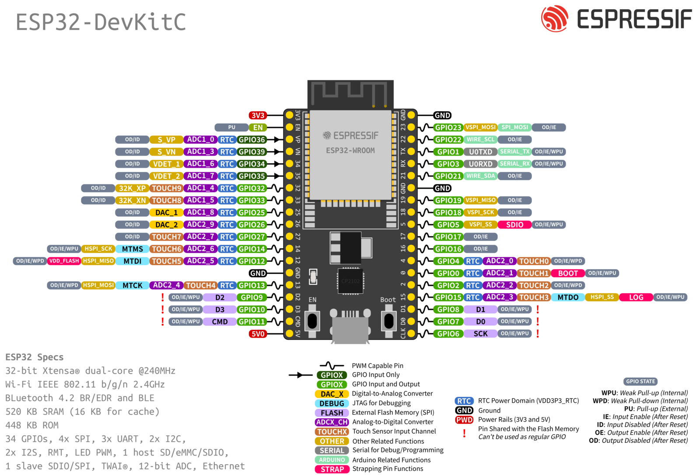

# Example scaffold for an ESP32 Zephyr project.

## Prerequisites

The following tools must be installed:
- cmake
- dtc
- python

## Workflow

### Create a new local workspace directory
```shell
mkdir esp32-zephyr-scaffold-ws
```

## Clone the repo into the workspace
```shell
cd esp32-zephyr-scaffold-ws
git clone https://github.com/yourname/your-app.git
```
`
## Create a Python virtual environment
```shell
python3 -m venv .venv
```

## Activate it
```shell
source .venv/bin/activate
```

## Install west
```shell
pip install west
```

## Initialize West from the application (manifest) directory
```shell
cd esp32-zephyr-scaffold
west init -l .
```

## Download the dependencies in the workspace
```shell
cd ..
west update
```

## Install Python requirements
```shell
pip install -r deps/zephyr/scripts/requirements.txt
```

## Source the environment script
```shell
source deps/zephyr/zephyr-env.sh
```

## Now you can build
```shell
cd esp32-zephyr-scaffold-ws
west build -b esp32_devkitc_wroom/esp32/procpu .
```

MCUboot must be built and flashed at least once. It can be built with sysbuild with:
```shell
west build -p always -b esp32_devkitc_wroom/esp32/procpu --sysbuild .
```

and flashed with:
```shell
west flash
```

The application only can be built with:
```shell
west build -p always -b esp32_devkitc_wroom/esp32/procpu .
```

View the serial output with:
```shell
west espressif monitor
```

Install TKinter in the system inorder to use the guiconfig:
```shell
sudo apt install python3-tk
```

This can be used for setting debug flags: https://docs.zephyrproject.org/latest/develop/tools/clion.html#configure-zephyr-parameters-for-debug
Use the `guiconfig` target and click the hammer icon.

When making these changes, they are "temporarily" saved:
Configuration saved to '/home/mchernosky/dev/hello_world/cmake-build-esp32/zephyr/.config'
To permanently make the changes, you would add them to a .conf file.



## CLion setup

Open the project at the workspace directory (the topdir) -- not the application.

Right click on the CMakeLists.txt file in the application directory and select "Load West Project."

Configure a new toolchain which uses the environment script from the project directory instead of the global installation. 
Use a west build, but configure it to use the new toolchain.
Then you can select the board in the west settings.

Configure a run configuration for the native sim build by setting the "Target" to `native_runner_executable` and the "Executable" to `build/zephyr/zephyr.exe`.

## native_sim build

The application can be built for the native_sim target with:

```shell
west build -p always -b native_sim .
```

And started by running:

```shell
./build/zephyr/zephyr.exe
```

This will log output to the console, and show the device used for the UART simulation.
Then you can connect to it with minicom or similar.

### Networking in native_sim
In order to use networking with the native sim build, before running the application use the network setup script ot configure the host network interface:
```shell
sudo deps/tools/net-tools/net-setup.sh --config nat.conf start
```

This runs the `net-setup.sh` script from the `net-tools` directory with the `nat.conf` configuration file.
This sets up the host interface that the application will connect to, runs a DHCP server on the interface and configures network address translation (NAT) for internet access.

Now when the application is run, it will get an IP address from the host.

You should be able to ping the host address with:
```shell
uart:~$ net ping 192.0.2.2                                                                                                                                                                              
PING 192.0.2.2                                                                                                                                                                                          
28 bytes from 192.0.2.2 to 192.0.2.13: icmp_seq=1 ttl=64 time=60 ms                                                                                                                                     
28 bytes from 192.0.2.2 to 192.0.2.13: icmp_seq=2 ttl=64 time=10 ms                                                                                                                                     
28 bytes from 192.0.2.2 to 192.0.2.13: icmp_seq=3 ttl=64 time=20 ms 
```

You should also be able to ping out the internet, for example with:
```shell
uart:~$ net ping 8.8.8.8                                                                                                                                                                                
PING 8.8.8.8                                                                                                                                                                                            
28 bytes from 8.8.8.8 to 192.0.2.24: icmp_seq=1 ttl=114 time=30 ms                                                                                                                                      
28 bytes from 8.8.8.8 to 192.0.2.24: icmp_seq=2 ttl=114 time=40 ms                                                                                                                                      
28 bytes from 8.8.8.8 to 192.0.2.24: icmp_seq=3 ttl=114 time=50 ms
```

DNS resolution should also work. For example:
```shell
uart:~$ net dns www.google.com                                                                                                                                                                          
Query for 'www.google.com' sent.                                                                                                                                                                        
dns: 142.250.72.36                                                                                                                                                                                      
dns: All results received
```

When finished running the application, then run:

```shell
sudo deps/tools/net-tools/net-setup.sh --config nat.conf stop
```

to remove the network configuration.

## Running on ESP32

Configure your WiFi network by setting the `CONFIG_WIFI_SSID` and `CONFIG_WIFI_PASSWORD` Kconfig variables.
For security, this can be done in an overlay config file and added to the build with:
```
west <commands> -- -DOVERLAY_CONFIG=overlay-wifi-file.conf
```

### Serial console

To connect the serial console on the ESP32, run `west espressif monitor`.

## TODO
- Only pull espressif dependencies for Zephyr? This would make `west update` faster.